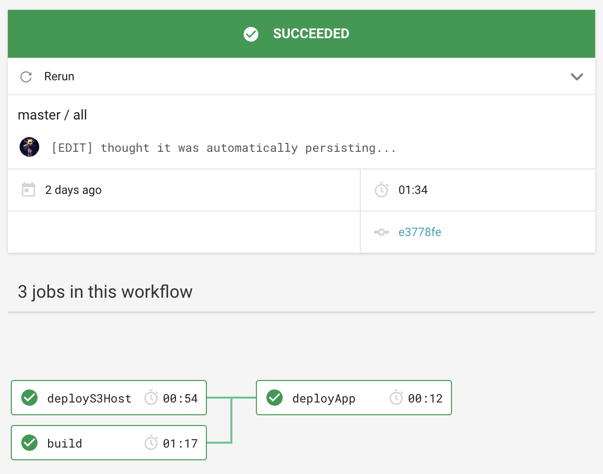

# react-sample

[](https://circleci.com/gh/giusedroid/react-sample)

## What

This is a simple static react application.  
Although functionally meaningless (it really doesn't do anything else than existing and being nice to look at<!-- just like myself-->), it helps demonstrating the following:

- what a CircleCI Workflow is
- how to deploy a React App to AWS
- what are the different phases of testing a Front-end application and how these can be automated ([Jest](https://jestjs.io/), [Cucumber](https://cucumber.io/), [Puppeteer](https://github.com/GoogleChrome/puppeteer))
- how nice and shiny [React](https://reactjs.org/) is


### Architecture


<!-- wow so much service - so many complexity - data whish whoosh accelerate -->

### CloudFormation Stacks

#### S3 Host

`cloudformation/00-s3-host.yml`  
This stack deploys an S3 bucket configured as a web host and the S3 bucket policy to allow `PublicRead` on the objects. This is the bucket where the application code will be uploaded and where the static webapp is served.

#### CloudFront CDN

`cloudformaiton/10-cloudfront.yml`  
This stack deploys a CDN for the webapp and wires it to the S3 host.  
This is deployed only for the production (stable) environment.  
At the moment it also deploys a DNS record for the distribution.

#### [WiP] DNS Records

`cloudformation/20-dns.yml`
This stack deploys a DNS record in Route53 for either the S3 host or the CloudFront distribution.

### Future Work

Please have a look at [this repo issues](https://github.com/giusedroid/react-sample/issues) for further details.  
The next milestones are:

- **\[Feature\] :** write and deploy the DNS records
- **\[Feature\] :** make it a Progressive Web App
- **\[Feature\] :** integrate `aws-amplify`
- **\[Feature\] :** hook it to a backend / auth (Cognito)

## Configure it

### Environment

Variables that must be in your (CI) environment to successfully deploy the stacks.  

| Variable Name | Description |
|---------------|-------------|
| AWS_ACCESS_KEY_ID | Your AWS Account Access Key |
| AWS_SECRET_ACCESS_KEY | Your AWS Account Access Secret Key |
| AWS_DEFAULT_REGION | Your Default AWS Region|
| APPLICATION_DOMAIN_NAME | Your domain name, for example `cloudreach.com`. The final domain will be `react-sample-${DEPLOY_TO}.cloudreach.com` |
| CLOUDFRONT_SSL_CERT_ARN | The ARN of an SSL certificate issued for `APPLICATION_DOMAIN_NAME` |
| HOSTED_ZONE_ID | The id of the hosted zone where `APPLICATION_DOMAIN_NAME` is hosted. |

### Imports

No imports are needed for this deployment package. Yay!

### Exports

This package exports nothing.

## Deploy it

Clone this repo, get a free account on CircleCi and configure the
build environment as described in the previous section.

### CircleCI workflow (so far)



#### build

This job is runs unit, component and acceptance tests on the codebase,
installs dependencies,
builds a production optimized package and stores it as workflow artifact.

#### deployS3Host

This job installs `aws cli` and deploys the infrastructure via `cloudformation deploy`.

#### deployApp

This job syncs the build folder with the s3 host.

## Run it

### Install dependencies

Install [nvm](https://github.com/creationix/nvm) and/or Node 10.13.0

```bash
nvm use
npm i
```

### Run unit / component tests

```bash
npm test
```

### Run the development server

```bash
npm start
```

### Build it

```bash
npm run build
```

### Run acceptance tests

Make sure the development server is running then

```bash
npx cucumber-js
```

## Deploy it from your machine

```bash
make local
```